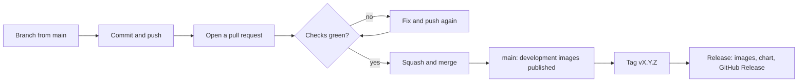

# How changes get into this repository

This page explains the whole journey of a change, from an idea on your laptop to a released
version: the branches, the pull requests, the automatic checks and the rules that protect `main`.
It is the "how does this repository work" guide. [CONTRIBUTING.md](../CONTRIBUTING.md) is the short
version, and [releasing.md](releasing.md) covers the release itself.

## The idea in one picture



Nobody pushes to `main` directly, me included. Everything goes through a pull request, and a pull
request can only be merged when the automatic checks have passed. That is the entire model. The
rest of this page is detail.

## The rules that protect `main`

These are set up as a *ruleset* in the repository settings (Settings → Rules → Rulesets):

| Rule | What it means for you |
|---|---|
| Changes only through a pull request | `git push origin main` is refused. You push a branch and open a PR |
| Required status checks | The PR cannot be merged until these pass: `Backend (lint, migrations, tests)`, `Frontend (unit tests)`, `Helm and monitoring`, `Build images (backend)` and `Build images (frontend)` |
| Linear history | No merge commits on `main`. That is why merging is always "squash and merge" |
| No force pushes, no deletion | The history of `main` can't be rewritten or lost |
| Tags `v*` are protected | A release tag can't be moved or deleted once it exists |

Approvals are not required, because the project has one maintainer and nobody can approve their own
pull request. What protects the branch is the green checks, not a second pair of eyes. If more
people join, requiring one approval is the natural next step (and `.github/CODEOWNERS` already asks
for a review from the maintainer).

## From idea to merged change

### 1. Start from a fresh `main`

```bash
git checkout main
git pull
```

### 2. Make a branch

Give it a name that says what it is about, with a prefix that matches the kind of change:

```bash
git checkout -b feat/release-tracking
```

The usual prefixes are `feat/`, `fix/`, `docs/`, `chore/` and `ci/`.

### 3. Work, and check as you go

Run what the CI will run, before you push. It is much faster than waiting for GitHub:

```bash
make check
```

That does the linting, the tests, the Helm checks and the version check. If you only touched one
area, the narrower commands are faster: `make lint`, `make test-backend`, `make test-frontend`,
`make helm-lint`.

### 4. Commit with a good message

Messages follow [Conventional Commits](https://www.conventionalcommits.org/): a type, an optional
area in brackets, and a short description of what the change does.

```bash
git add -A
git commit -m "feat: track GitHub releases"
```

You can make as many commits as you like on the branch. Only the title of the pull request
matters in the end, because everything is squashed into a single commit on `main`.

### 5. Push the branch and open a pull request

```bash
git push -u origin feat/release-tracking
```

GitHub then shows a yellow **Compare & pull request** banner on the repository page. Click it,
give the pull request a title in the same Conventional Commits style (this title becomes the commit
message on `main`), fill in the checklist that appears, and create it.

### 6. Wait for the checks

The moment the pull request exists, GitHub starts the checks described below. You see them at the
bottom of the pull request, each one with a green tick, a red cross or a yellow dot.

If they are all green, you are done waiting. If one is red, see
[When a check fails](#when-a-check-fails).

### 7. Merge

Click **Squash and merge**, then **Confirm**. GitHub folds the whole branch into one commit on
`main` and deletes the remote branch. Then tidy up locally:

```bash
git checkout main
git pull
git branch -d feat/release-tracking
```

## The automatic checks

Three workflows live in `.github/workflows/`, and Dependabot works alongside them.

| Workflow | When it runs | What it does |
|---|---|---|
| **CI/CD** (`ci.yml`) | Every pull request to `main`, every push to `main` | Linting, tests, Helm and version checks, image builds. On a push to `main` it also publishes development images |
| **Security** (`security.yml`) | Every pull request, every push to `main`, and every Monday morning | CodeQL analyses the Python and JavaScript code; Trivy scans dependencies, Dockerfiles and Helm files |
| **Release** (`release.yml`) | When a tag `vX.Y.Z` is pushed | Verifies the version, tests, publishes images and the Helm chart, creates the GitHub Release |
| **Dependabot** (`dependabot.yml`) | Weekly | Opens pull requests for outdated dependencies, actions and base images |

### The checks in CI/CD, one by one

These names are the ones you see in the pull request, and the first five are *required*:

| Check | What it verifies | Run it yourself with |
|---|---|---|
| `Backend (lint, migrations, tests)` | Ruff passes, the migrations apply to a real PostgreSQL, the models match the migrations (`alembic check`), and all backend tests pass | `make lint` and `make test-backend` |
| `Frontend (unit tests)` | The JavaScript tests pass | `make test-frontend` |
| `Helm and monitoring` | The version is the same everywhere, the Grafana dashboard and its copy in the chart match, the chart lints and renders for kind and OpenShift, and `docker-compose.yml` is valid | `make helm-lint`, `make sync-check`, `make version-check` |
| `Build images (backend)` | The backend image builds | `docker build backend` |
| `Build images (frontend)` | The frontend image builds | `docker build frontend` |
| `Publish … image (main)` | Only after a merge: builds and publishes the `main` and `sha-…` images for amd64 and arm64 | not run locally |

### The checks in Security

`CodeQL (python)`, `CodeQL (javascript-typescript)` and `Trivy` are not required to merge, but
please read what they report: findings show up under the repository's **Security → Code scanning**
tab. Trivy in this workflow only reports; it never blocks a merge.

## When a check fails

1. Open the pull request, find the red check and click **Details**. GitHub shows the failing step
   with its log.
2. Read the last lines of the failing step. The reason is nearly always there.
3. Reproduce it locally with the command from the table above, fix it, and push again. The pull
   request updates and the checks re-run by themselves.

A few situations come up more than others:

| What you see | What it usually is |
|---|---|
| `ruff format --check` fails | Run `make format` and commit the result |
| `alembic check` says new operations were detected | You changed a model but didn't write the migration. See [development.md](development.md#changing-the-database) |
| "Monitoring files are out of sync" | You edited the Grafana dashboard. Run `make sync-monitoring` and commit both copies |
| "Version mismatch" | A version field was edited by hand. Use `scripts/version.sh set X.Y.Z` |
| A test passes locally and fails in CI | CI uses a fresh PostgreSQL and a clean checkout. Look for a test that depends on leftover data or on your `.env` |
| "This branch is out of date with the base branch" | `main` moved on while you worked. Click **Update branch** on the pull request, or rebase (below) |

## Keeping your branch up to date

If `main` has moved while your pull request was open, bring your branch up to date:

```bash
git fetch origin
git rebase origin/main
git push --force-with-lease
```

`--force-with-lease` is the safe kind of force: it refuses to overwrite anything you haven't seen.
You only ever force-push your own branch, never `main`.

If the rebase stops with a conflict, open the files it lists, resolve the marked sections, then
`git add` them and run `git rebase --continue`. If it gets messy, `git rebase --abort` puts
everything back the way it was.

## When you committed on `main` by mistake

It happens to everyone. Because `main` is protected, the push will be refused with a message
that mentions `GH013` or "Repository rule violations". Nothing is lost: move your commits to a new
branch and put your local `main` back.

```bash
git branch feat/my-change
git reset --hard origin/main
git checkout feat/my-change
git push -u origin feat/my-change
```

The first line saves your commits on a new branch, the second resets `main` to what GitHub has,
and the rest continue as usual.

## Dependabot pull requests

Every Monday, Dependabot looks for newer versions and opens pull requests titled `chore(deps): ...`
or `ci: ...`. They go through the same checks as your own changes. How to treat them:

- **GitHub Actions and Python dependencies:** if the checks are green and the change is a minor or
  patch update, merge it.
- **Base images (Grafana, Prometheus, PostgreSQL, nginx):** be careful. The Helm chart pins its own
  versions, so accepting one here would make Docker Compose and Kubernetes run different versions.
  Change both together, run `make up` and `make smoke-test`, and only then merge. Major upgrades of
  Grafana, Prometheus, PostgreSQL and Python are ignored on purpose (see `.github/dependabot.yml`).
- **When you don't want an update:** close the pull request. Comment
  `@dependabot ignore this minor version` if you don't want to see it again.
- **A Dependabot pull request that has fallen behind:** comment `@dependabot rebase`.

## What happens after a merge

A push to `main` runs CI/CD again, and its `Publish … image (main)` jobs publish two development
images per component: one tagged `main` (always the latest merge) and one tagged
`sha-<commit>` (that exact commit). They are handy for trying something before it is released.

Nothing is *released* by a merge. `latest` and the numbered versions only move when a tag is
pushed. See [releasing.md](releasing.md) for that.

## Who can do what

| | Can do | Cannot do |
|---|---|---|
| Anyone | Fork, open issues, open pull requests from a fork | Push to this repository |
| The maintainer | Create branches, open and merge pull requests, push tags | Push to `main`, move or delete a release tag |

## Where the rules live

| What | Where |
|---|---|
| Branch and tag rules | Repository **Settings → Rules → Rulesets** (they are settings, not files, so they are not in the repository) |
| Workflows | `.github/workflows/` |
| Dependabot | `.github/dependabot.yml` |
| Pull request checklist | `.github/pull_request_template.md` |
| Issue forms | `.github/ISSUE_TEMPLATE/` |
| Reviewer | `.github/CODEOWNERS` |
| Release note categories | `.github/release.yml` |

## A short glossary

- **Branch:** your own line of work, so `main` stays stable while you experiment.
- **Pull request (PR):** a request to merge your branch into `main`, where the checks run and the
  change can be reviewed.
- **Status check:** an automatic test that reports green or red on a pull request.
- **Ruleset:** the repository settings that say what is allowed on a branch or a tag.
- **Squash and merge:** combine all commits of a pull request into one commit on `main`.
- **Rebase:** replay your commits on top of the latest `main`, for a straight history.
- **Tag:** a permanent label on one commit, used for versions such as `v0.2.0`.
